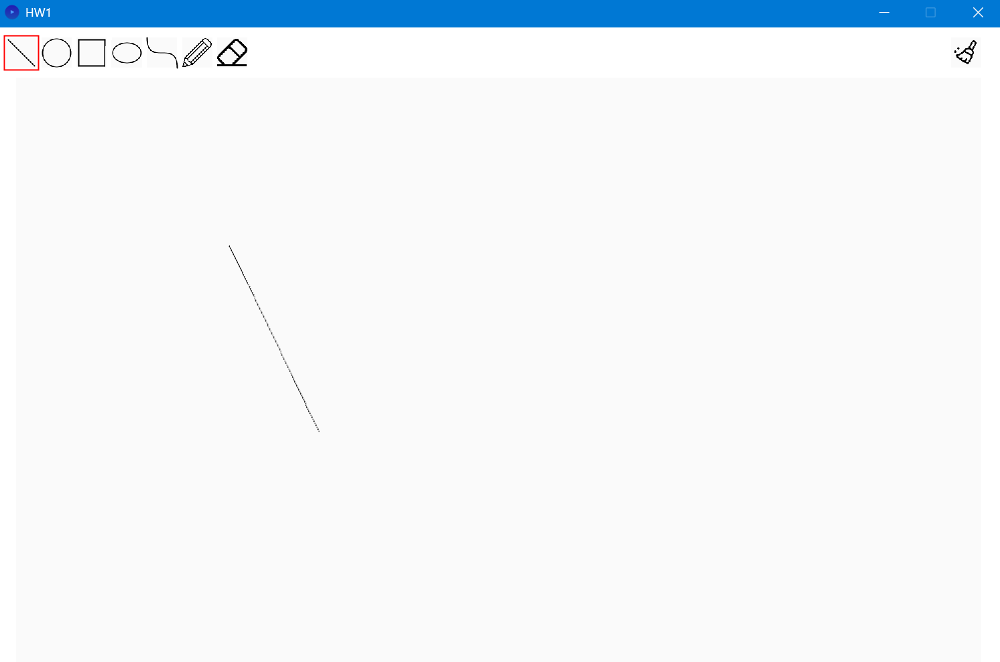
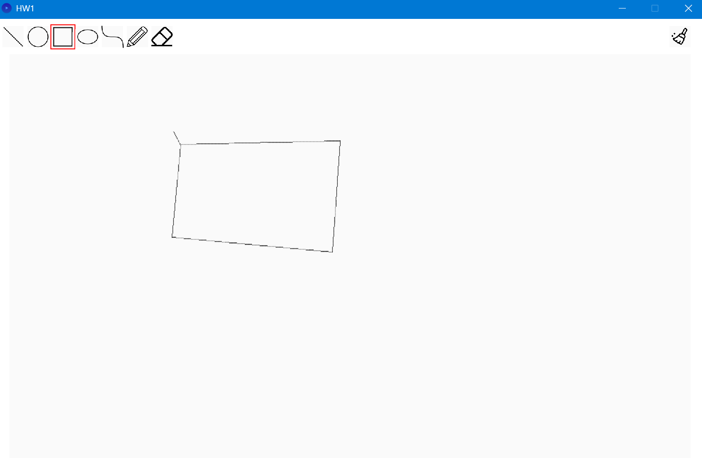
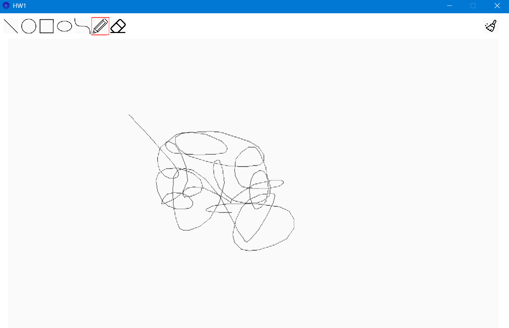
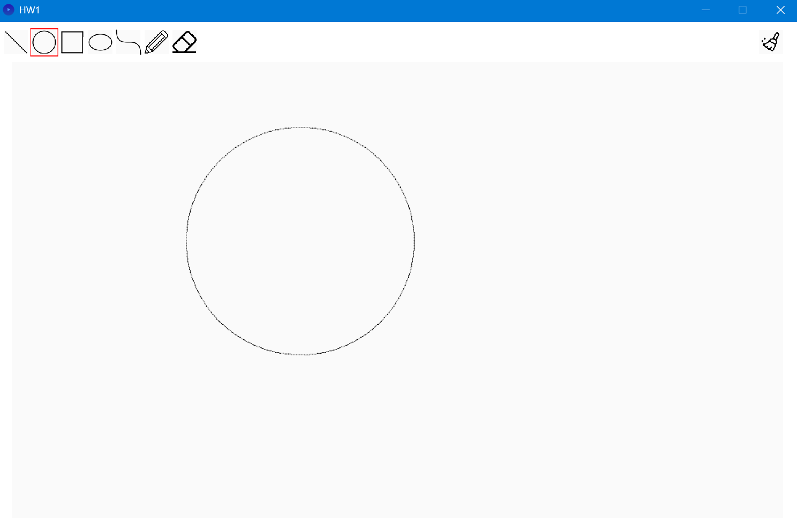
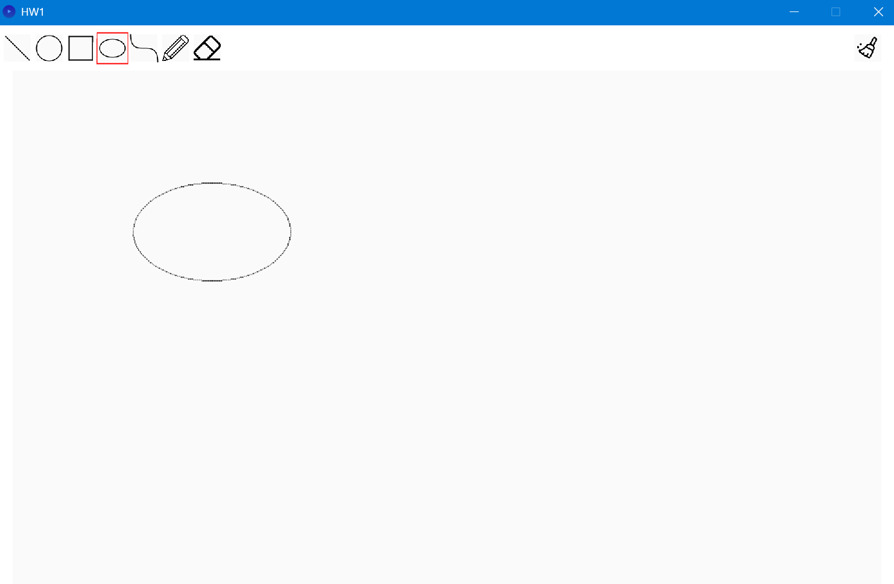
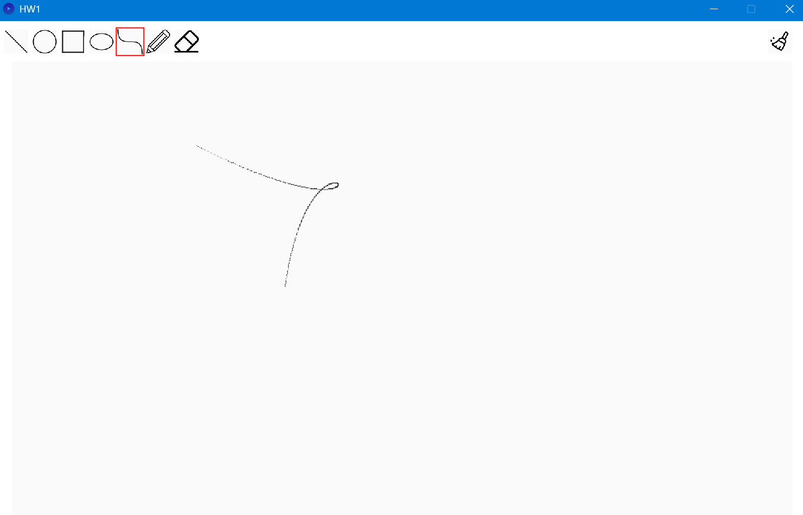
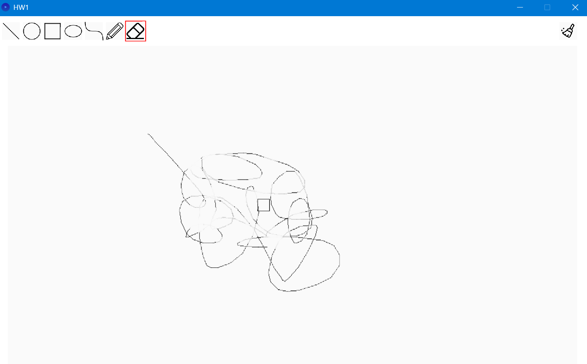

> Important: please check all images are under ./img, if not, all images on README.md wouldn't show correctly
# tasks completed
```
Line algorithm
Circle Algorithm
Ellipse Algorithm
Bézier Curve Algorithm
Eraser
```

## Line algorithm
```
selected algorithm: Bresenham's Line Algorithm
```
```java
while (true) {
        drawPoint(x0, y0, color(0));

        if (x0 == x1i && y0 == y1i) break;
        int e2 = 2 * err;

        if (e2 > -dy) {
            err -= dy;
            x0 += sx;
        }

        if (e2 < dx) {
            err += dx;
            y0 += sy;
        }
    }
```
```
key code snippets:
	1. calculate the error, if error is tolerable, then add differential on x-axis or y-axis
```



## Circle Algorithm
```
selected algorithm: Midpoint Circle Algorithm
```
```java
// Helper function to draw all 8 symmetric points of a circle
private void drawCirclePoints(float centerX, float centerY, float x, float y) {
    // Draw points in all 8 octants using symmetry
    drawPoint(centerX + x, centerY + y, color(0));  // Octant 1
    drawPoint(centerX - x, centerY + y, color(0));  // Octant 2
    drawPoint(centerX + x, centerY - y, color(0));  // Octant 3
    drawPoint(centerX - x, centerY - y, color(0));  // Octant 4
    drawPoint(centerX + y, centerY + x, color(0));  // Octant 5
    drawPoint(centerX - y, centerY + x, color(0));  // Octant 6
    drawPoint(centerX + y, centerY - x, color(0));  // Octant 7
    drawPoint(centerX - y, centerY - x, color(0));  // Octant 8
}
```
```
key code snippets:
	1. split into 8 zones, draw 8 points at a time
```


## Ellipse Algorithm
```
selected algorithm: Midpoint Ellipse Algorithm
```
```java
void drawEllipsePoints(float cx, float cy, float x, float y) {
    // Draw points in all 4 quadrants using symmetry
    drawPoint(round(cx + x), round(cy + y), color(0)); // Quadrant 1
    drawPoint(round(cx - x), round(cy + y), color(0)); // Quadrant 2
    drawPoint(round(cx + x), round(cy - y), color(0)); // Quadrant 4
    drawPoint(round(cx - x), round(cy - y), color(0)); // Quadrant 3
}
```
```
key code snippets:
	1. split into 4 zones, draw 4 points at a time
```


## Bézier Curve Algorithm
```
selected algorithm: Cubic Bézier rasterization
```
```java
private Vector3 evalCubicBezier(Vector3 a, Vector3 b, Vector3 c, Vector3 d, float t) {
    float u = 1 - t;
    float uu = u * u;
    float uuu = uu * u;
    float tt = t * t;
    float ttt = tt * t;

    Vector3 termA = a.mult(uuu); // (1-t)^3 * a
    Vector3 termB = b.mult(3 * uu * t); // 3(1-t)^2 t * b
    Vector3 termC = c.mult(3 * u * tt); // 3(1-t) t^2 * c
    Vector3 termD = d.mult(ttt); // t^3 * d

    return termA.add(termB).add(termC).add(termD);
}
```
```
key code snippets:
	1. mathematical formula: b(t) = (1 − t)^3 * b0 + 3t * (1 − t)^2 * b1 + 3 * t^2 * (1 − t) * b2 + t^3 * b3 for t ∈ [0, 1]
```

## Eraser
```
selected algorithm: 
```
```java
float x1 = min(p1.x, p2.x);
float x2 = max(p1.x, p2.x);
float y1 = min(p1.y, p2.y);
float y2 = max(p1.y, p2.y);

for (float xx = x1; xx <= x2; xx++) {
	for (float yy = y1; yy <= y2; yy++) {
		drawPoint(round(xx), round(yy), color(250));
	}
}
```
```
key code snippets:
	1. fill the rectangle area with white points := erase the stroke lying in rectangle
```

## LLM usage
```
used LLM: copilot GPT-5 mini
how I used it:
	1. find the algorithm I want to implement
	2. ask copilot how to implement it, and let it complete it for me
	3. if it work well, I ask copilot code snippets to understand why
	   if it has bug, I find the bug and ask why and how to fix it
```